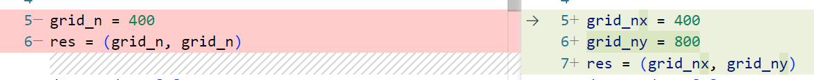
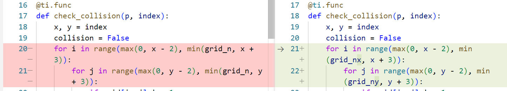
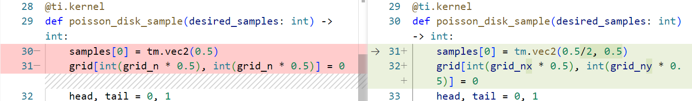
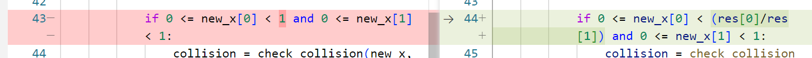
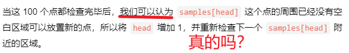
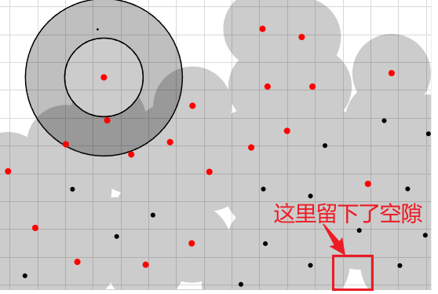
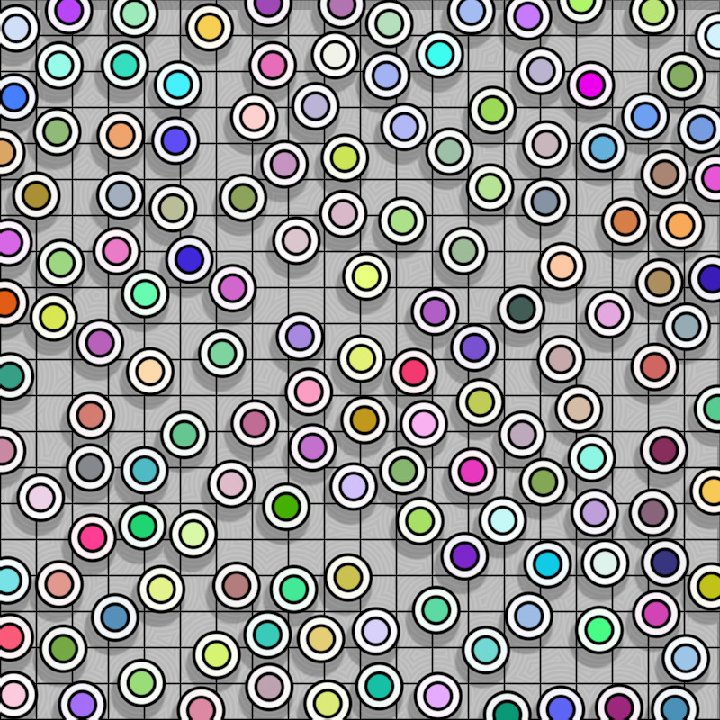

# My README

本着最小化修改原则（能不改就不改，尽量增加而不修改，不去破坏原有代码逻辑结构）进行了修改
## easy解法
切换到分支easy可以查看easy代码
```
git checkout easy
```
与原代码相比，easy只做了如下修改

首先更改下网格的大小，增加一个grid_ny

然后把所有原本grid_n的地方都换成grid_nx和grid_ny


最后（也是最关键的），把new_x(代表的是新落点的位置)的边界更改一下


效果为：


也就是只是洒落了半边。既然这是可以的，你可以选定任意区域撒点。只要修改上面那个if中（44行）的边界即可。


## medium解法
先跳过，既然numpy和numba都以及写好了，暂时还想不出有什么其他的python数值计算库

## hard解法
原文中有这句话：


>当这 100 个点都检查完毕后，我们可以认为 samples[head] 这个点的周围已经没有空白区域可以放置新的点，所以将 head 增加 1，并重新检查下一个 samples[head] 附近的区域。

问题是：
真的是这样吗？

泊松圆盘采样留着空隙的原因在于它是随机撒点的。只要是随机撒点，就不能保证每个网格内都有一个点。很有可能在两个圆形的空隙处没有被撒点。

可以看一下这个博客的动画
https://bl.ocks.org/mbostock/dbb02448b0f93e4c82c3


我盯了半天，发现留着缝隙的可能性还是有的。因为撒点的终止条件是随机撒点的次数（比如taichi这个代码就是在每个圆环内撒了100次，不管是不是保证每个网格都洒了，只要撒了100次就终止）

比如下面这个小缝隙。怎么样？很刁钻吧！周围都是已经洒满了100次的黑色点，表示没有任何一个点再会被检查其圆环了。因此这里永久性地留下了空白。



那么我们就有两个方案：
1. 找到小缝隙，然后在缝隙中洒点 
2. 先在每个网格中洒点，然后去除冲突的点

方案1是较为复杂的。这是因为小缝隙（专业术语被称为gap 或者void）形状是不规则的，很难去找到不规则的形状。 目前有许多新算法是针对如何找到这个小缝隙的。比如 Ebeida2011等（参考文献8，文献9，文献10）.

方案2简单一些。这种方案的专业名称被称为是Elimination算法，也就是消除算法。Bridson2007的Poisson Disk sampling属于是上采样。也就是从给定点开始逐步向外扩散式地生成点。（应该算是广度优先搜索的思想）。而我们反其道而行之，采用降采样。也就是先洒多一点，保证每个都有覆盖，然后再去消除重叠的。

我们采用方案2

首先在每个方格内部都随机洒点，得到


## 参考文献

1. 太极微信公众号文章
https://mp.weixin.qq.com/s/OpMTkCX-J6_SzSumHJcVJg

2. taichi关于泊松圆盘采样的代码
https://github.com/taichi-dev/taichi_elements/blob/master/engine/voxelizer.py

3. 一个关于泊松圆盘采样的技术博客（javascript)
https://bl.ocks.org/mbostock/dbb02448b0f93e4c82c3

4. 一个关于泊松圆盘采样的技术博客(c#)
https://sighack.com/post/poisson-disk-sampling-bridsons-algorithm

5. 一个关于泊松圆盘采样的技术博客(除了泊松圆盘，还有另一个算法：加权消除采样）
https://medium.com/@hemalatha.psna/implementation-of-poisson-disc-sampling-in-javascript-17665e406ce1

6. 一个关于泊松圆盘采样的YouTube视频（Unity)
https://youtu.be/7WcmyxyFO7o

7. Robert Bridson 2007年提出该算法的原始文献
https://www.cs.ubc.ca/~rbridson/docs/bridson-siggraph07-poissondisk.pdf
以及ACM DL（附件含C++代码）
https://dl.acm.org/doi/10.1145/1278780.1278807

8.  寻找小缝隙的算法
Ebeida, M., Patney, A., Mitchell, S., Davidson, A., Knupp, P., Owens, J. 2011. Efficient Maximal Poisson-Disk 
Sampling. ACM Trans. Graph. 30, 4, Article 49 (July 2011), 12 pages. DOI = 10.1145/1964921.1964944 
http://doi.acm.org/10.1145/1964921.1964944.

9.  寻找小缝隙的算法
Weize Quan, Dong-Ming Yan, Jianwei Guo, Weiliang Meng,  Xiaopeng Zhang, 2016.
Maximal Poisson-disk Sampling via Sampling Radius Optimization
http://dx.doi.org/10.1145/3005274.3005281

10.  寻找小缝隙的算法
Tong Wang, Reiji Suda, 2017. Fast Maximal Poisson-Disk Sampling by Randomized Tiling
Sampling. ACM Trans. Graph. 30, 4, Article 49 (July 2011), 12 pages. DOI = 10.1145/1964921.1964944 
10.1145/3105762.3105778

**The bellowing is the old README**
-------

# The challenge

Challenge 1 (easy): modify the code so that it works for any resolution `(width, height)`, e.g. `640 x 480`.

Challenge 2 (medium): implement Bridson's Poisson disk sampling algorithm with other Python packages, use the same config with this repo (400x400 grid and 100K desired points) and whatever acceleration tricks. See if you can beat the speed of Taichi. (the compile time will not be counted)

Challenge 3 (hard): improve the code so that the result is a maximal Poisson sampling, that is, there won't be any room left to insert new points.

Please submit your work in this [issue](https://github.com/taichi-dev/poisson-sampling-homework/issues/1).

# Install taichi

```
pip3 install -r requirements.txt  
```

# An interative animation

Mouse and keyboard control:

1. Click mouse to choose an initial point.
2. Press `p` to save screenshots.

Example:

<p align="center">
  </img>
</p>


# Benchmark with NumPy and Numba

See this repo:

https://github.com/taichi-dev/taichi_benchmark/tree/main/poisson

You are encouraged to implement a faster one to beat ours!
